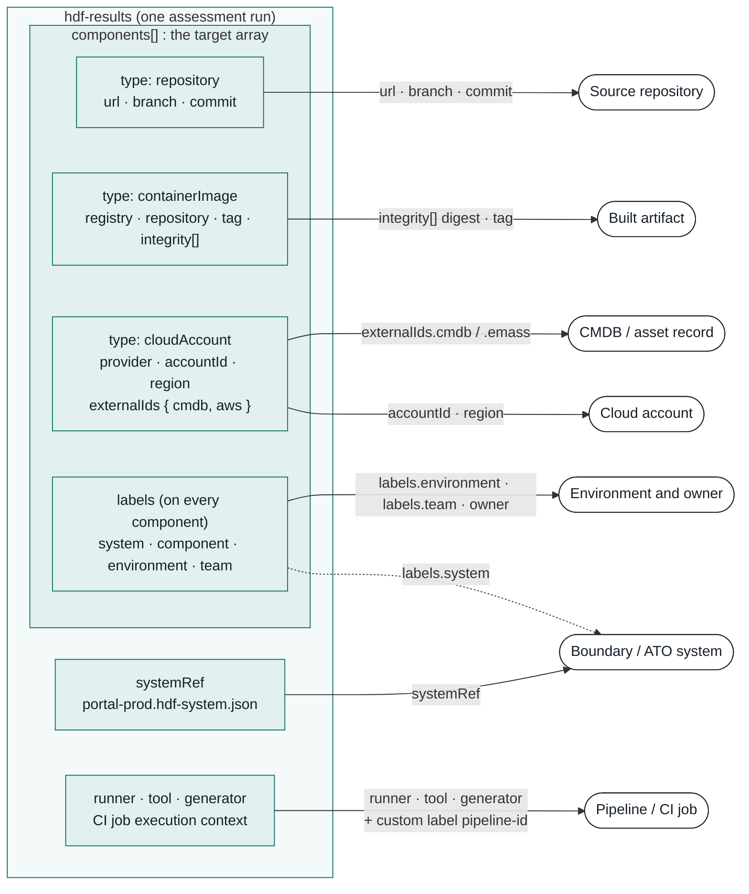
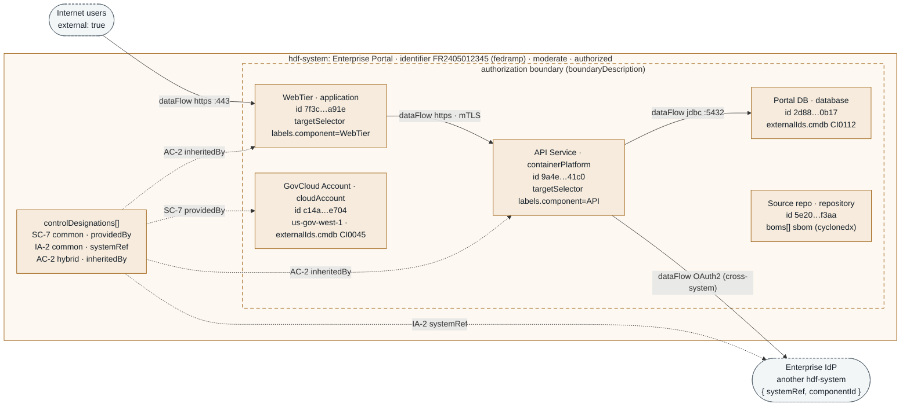
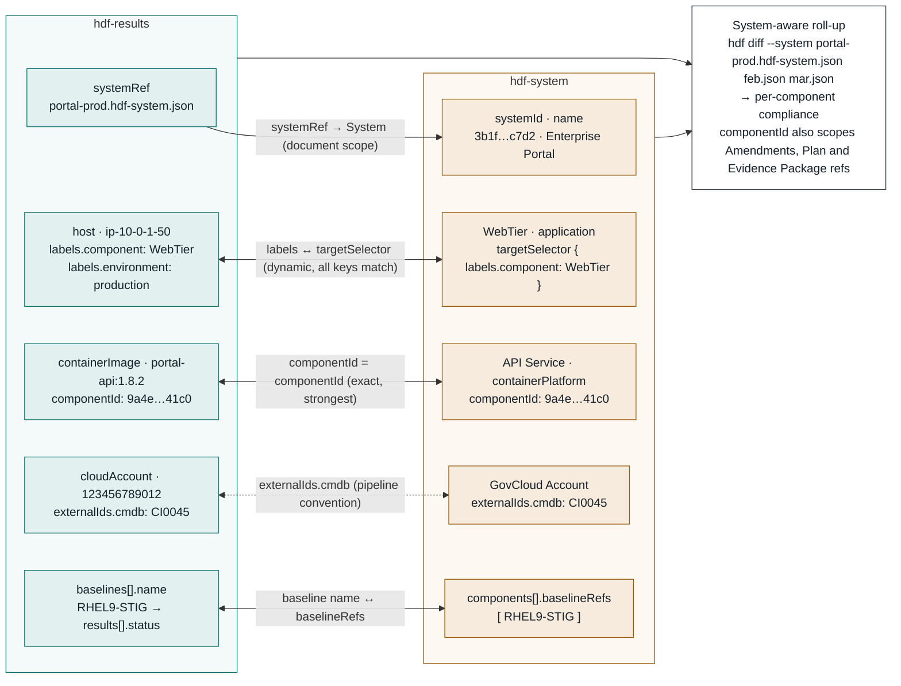

# Evidence Provenance in HDF v3

Three views of the same question: where did this piece of evidence come from, and which authorization boundary does it count toward? Field names follow the HDF v3.7.0 specification.

In v3 the Results `components[]` array is the target array. The legacy SAF `target` supplement (`id`, `type`, `boundary`) is absorbed into a `components[]` entry, with `boundary` moved to `labels`.

> Legend: teal = `hdf-results`, ochre = `hdf-system`, white = provenance question or join key.

## 1. The target array as a provenance record

*hdf-results*

Each entry in `components[]` is typed (`repository`, `containerImage`, `cloudAccount` and ten others), and each type carries its own identity fields. With `labels`, `externalIds`, and the document-level `systemRef`, `runner` and `tool`, one Results file can say which boundary, code, build, account, asset record and environment produced the finding.



*Every provenance question is answered by a schema field, not by free text. Typed component fields carry identity (commit, digest, account); labels carry grouping (boundary, environment, team); externalIds carry the link to the system of record.*

| Provenance question | HDF v3 field(s) | Kind |
|---|---|---|
| Boundary / ATO system | `systemRef` · `labels.system` | document link · well-known label |
| Pipeline / CI job | `runner` · `tool` · `generator` · `labels.pipeline-id` | root fields · custom label |
| Source repository | `repository` component: `url` · `branch` · `commit` | typed component |
| Built artifact | `containerImage` component: `registry` · `tag` · `integrity[]` | typed component |
| Cloud account | `cloudAccount` component: `provider` · `accountId` · `region` | typed component |
| CMDB / asset record | `externalIds.cmdb` · `externalIds.emass` | external ID map |
| Environment and owner | `labels.environment` · `labels.team` · `owner` | well-known labels · identity |

> **Note:** `pipeline-id` is a custom label. The five well-known label keys are `system`, `component`, `environment`, `region` and `team`.

<details>
<summary>Example components[] with provenance</summary>

```json
{
  "systemRef": "portal-prod.hdf-system.json",
  "components": [
    { "type": "repository", "name": "portal-api",
      "url": "https://gitlab.example.gov/portal/portal-api",
      "branch": "main", "commit": "4f9c2e1",
      "labels": { "system": "Enterprise Portal", "component": "API",
                  "environment": "production", "team": "platform-eng",
                  "pipeline-id": "88231" } },
    { "type": "containerImage", "name": "portal-api:1.8.2",
      "registry": "registry.example.gov", "repository": "portal/portal-api", "tag": "1.8.2",
      "integrity": [ { "algorithm": "sha256", "value": "9b2d…" } ] },
    { "type": "cloudAccount", "name": "portal-govcloud",
      "provider": "aws", "accountId": "123456789012", "region": "us-gov-west-1",
      "externalIds": { "cmdb": "CI0045", "aws": "123456789012" } }
  ]
}
```

</details>

<details>
<summary>Stamp labels in the pipeline</summary>

```bash
# stamp labels at conversion time, or afterward in the pipeline
hdf convert --from nessus scan.nessus -o results.json \
  --labels system="Enterprise Portal",environment=production,region=us-gov-west-1
hdf label set results.json component=API pipeline-id=$CI_PIPELINE_ID
```

</details>

## 2. The System document as the provenance authority

*hdf-system*

Results say what was scanned. The System document says what the boundary contains, and it is the authority those claims are checked against. Components here require a `componentId`, `identifier` ties the system to its FedRAMP or eMASS record, `dataFlows` show which edges cross the boundary, and `controlDesignations` record who provides each control.



*The System document is the authoritative inventory. Its componentIds are the keys that Plans, Amendments, Evidence Packages and control designations bind to, and its dataFlows show every edge that leaves the boundary.*

| System field | Provenance role |
|---|---|
| `systemId` · `identifier` · `identifierScheme` | Stable identity; link to the FedRAMP package or eMASS record |
| `components[].componentId` | Required here; the key Plans, Amendments, Evidence Packages and control designations bind to |
| `components[].targetSelector` | Label selector that pulls matching Results components into this System component |
| `components[].externalIds` | Link to CMDB, AWS, Azure or eMASS inventory |
| `dataFlows[]` | Edges between components, to another system (`{systemRef, componentId}`), or to an external endpoint |
| `controlDesignations[]` | `common` / `system-specific` / `hybrid`, with `providedBy`, `systemRef` or `inheritedBy` |
| `boms[]` | System-scoped BOMs; component-scoped BOMs attach on the component |

<details>
<summary>Example hdf-system (abridged)</summary>

```json
{
  "name": "Enterprise Portal",
  "systemId": "3b1f6a0e-2c4d-4e8a-9f1b-6d2e8c47c7d2",
  "identifier": "FR2405012345", "identifierScheme": "fedramp",
  "categorizationLevel": "moderate", "authorizationStatus": "authorized",
  "components": [
    { "componentId": "7f3c2b10-5d4e-4a61-8c2f-0b9e1d6aa91e",
      "name": "WebTier", "type": "application",
      "targetSelector": { "labels.component": "WebTier" },
      "baselineRefs": [ "RHEL9-STIG" ],
      "externalIds": { "cmdb": "CI0101" } },
    { "componentId": "c14a9e62-7d0b-4f38-8e5a-2b6f3d91e704",
      "name": "GovCloud Account", "type": "cloudAccount",
      "provider": "aws", "accountId": "123456789012", "region": "us-gov-west-1",
      "externalIds": { "cmdb": "CI0045" } }
  ],
  "dataFlows": [
    { "from": "7f3c2b10-5d4e-4a61-8c2f-0b9e1d6aa91e",
      "to":   "9a4e7c21-3f5b-4d8e-a2c6-7e1f0d9b41c0",
      "protocol": "https", "port": 443, "authentication": "mTLS",
      "direction": "unidirectional" },
    { "from": "9a4e7c21-3f5b-4d8e-a2c6-7e1f0d9b41c0",
      "to": { "systemRef": "enterprise-idp.hdf-system.json",
              "componentId": "0e61d2c8-4a97-4b3e-9c15-8f2a7d6b3e90" },
      "protocol": "https", "authentication": "OAuth2" }
  ],
  "controlDesignations": [
    { "controlId": "SC-7", "designation": "common",
      "description": "Boundary protection provided by the GovCloud VPC",
      "providedBy": "c14a9e62-7d0b-4f38-8e5a-2b6f3d91e704" }
  ]
}
```

</details>

## 3. Correlating Results targets with the System

*hdf-results ⇄ hdf-system*

Results and System meet at five join points. `systemRef` ties the whole file to a boundary. After that, each Results component resolves to a System component in one of three ways: a label match through `targetSelector`, an exact `componentId`, or a shared `externalIds` value. The baselines that ran are then checked against the component's `baselineRefs`.



*Solid joins are defined by the spec; the dashed externalIds join is a convention. All joins feed `hdf diff --system` for a per-component roll-up.*

| Join | Results side | System side | Strength |
|---|---|---|---|
| Document scope | `systemRef` | the System file (`systemId`, `name`) | defined by spec |
| Label selector | `components[].labels` | `components[].targetSelector` | defined by spec · dynamic, all keys must match |
| Component identity | `components[].componentId` | `components[].componentId` | defined by spec · exact, strongest |
| System of record | `components[].externalIds.cmdb` | `components[].externalIds.cmdb` | pipeline convention |
| Baseline coverage | `baselines[].name` | `components[].baselineRefs` | defined by spec |

> **Note:** The schema defines the `externalIds` map (`aws`, `azure`, `cmdb`, `emass`) but does not treat it as a correlation key; enforce it in your pipeline if you rely on it. Prefer `componentId` when the producer can stamp it, and use `targetSelector` so new hosts join their System component through labels without an edit to the System document.

<details>
<summary>Pipeline commands for the join</summary>

```bash
# 1. Stamp the label the System's targetSelector expects
hdf label set results.json system="Enterprise Portal" component=WebTier environment=production

# 2. Inspect what will match
hdf label show results.json

# 3. Roll results up against the boundary
hdf diff --system portal-prod.hdf-system.json feb-scan.json mar-scan.json
```

</details>

---

Example identifiers, UUIDs and account numbers are illustrative.

**Sources**

- [HDF v3.7.0 Specification](https://mitre.github.io/hdf-libs/docs/specification/hdf-specification.html)
- [Well-Known Label Keys Reference](https://mitre.github.io/hdf-libs/docs/guides/label-keys-reference.html)
- [hdf-libs #354: SAF supplement normalization](https://github.com/mitre/hdf-libs/pull/354)
- [hdf-libs #370: hdf target / passthrough commands](https://github.com/mitre/hdf-libs/pull/370)
