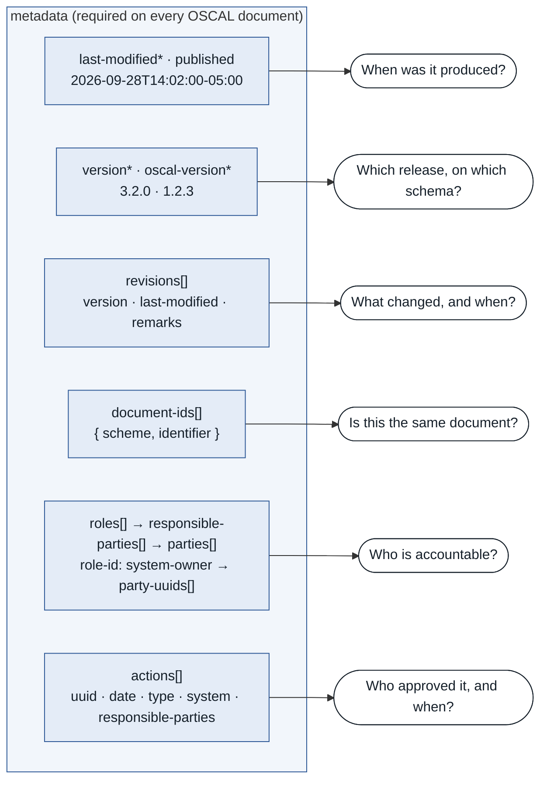
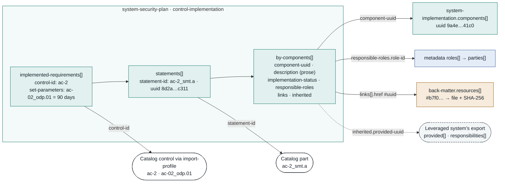
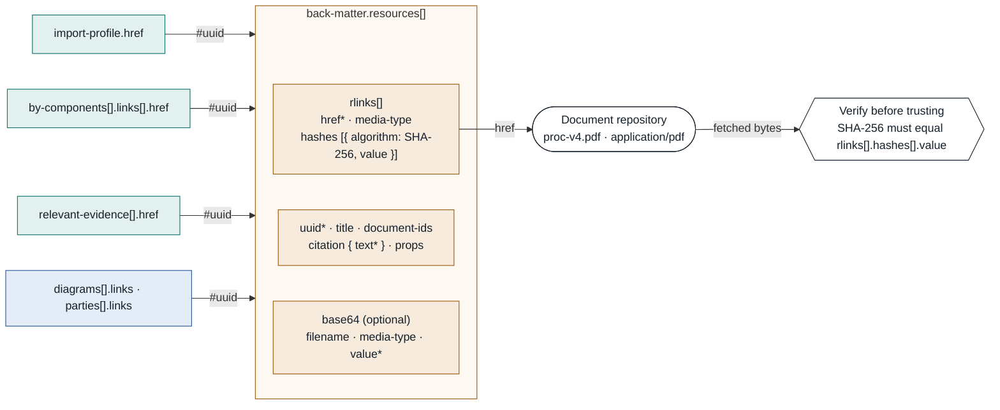
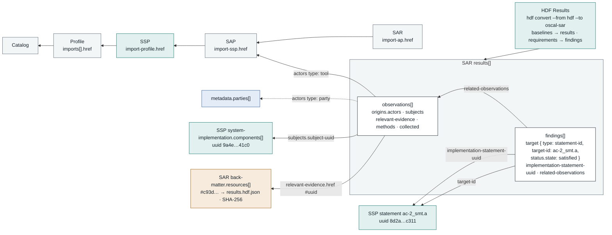

# OSCAL Provenance Chain

Every OSCAL document carries three kinds of provenance. Metadata says who produced it, when, and who approved it. Control responses say how each control is met, by which component, and who is responsible. Back-matter holds the evidence itself, located by URI and pinned by hash. All of it is linked by UUID, so a tool can follow a claim to its evidence without a person reading a PDF. That traversal is what makes automated assessment possible.

Field names and enumerations follow the OSCAL v1.2.3 JSON schemas; every JSON example on this page validates against them.

> Legend: blue = metadata (who, when), teal = control responses (how), ochre = back-matter (what evidence), white = provenance question or reference target.

## 1. Metadata answers who, when, and which version

*metadata (on every OSCAL document)*

The `metadata` block is required on every catalog, profile, component definition, SSP, SAP, SAR and POA&M. Four fields are mandatory: `title`, `last-modified`, `version` and `oscal-version`. The optional parts carry the rest of the provenance: a change history in `revisions`, stable identity in `document-ids`, accountable people through `roles`, `responsible-parties` and `parties`, and approvals recorded as `actions`.



*Provenance lives in one block, in the same shape on every model. An approval is an action with a date and a responsible party, not a signature image.*

| Provenance question | Metadata field(s) |
|---|---|
| When was it produced? | `last-modified`\* · `published` |
| Which release, on which schema? | `version`\* · `oscal-version`\* |
| What changed, and when? | `revisions[]` (`version`, `last-modified`, `remarks`) |
| Is this the same document? | `document-ids[]` (`scheme`, `identifier`) |
| Who is accountable? | `roles[]` → `responsible-parties[]` (`role-id`, `party-uuids`) → `parties[]` |
| Who approved it, and when? | `actions[]` (`uuid`, `date`, `type`, `system`, `responsible-parties`) |

> **Note:** \* required. Every `responsible-roles[].role-id` elsewhere in the document resolves through metadata to a named party.

<details>
<summary>Example metadata (SSP)</summary>

```json
"metadata": {
  "title": "Enterprise Portal System Security Plan",
  "published": "2026-09-01T09:00:00-05:00",
  "last-modified": "2026-09-28T14:02:00-05:00",
  "version": "3.2.0",
  "oscal-version": "1.2.3",
  "revisions": [
    { "version": "3.1.0", "last-modified": "2026-06-15T10:00:00-05:00",
      "remarks": "Annual review; AC family updated" }
  ],
  "document-ids": [
    { "scheme": "http://www.doi.org/", "identifier": "10.99999/portal-ssp" }
  ],
  "roles": [
    { "id": "system-owner", "title": "System Owner" },
    { "id": "identity-admin", "title": "Identity Administrator" }
  ],
  "parties": [
    { "uuid": "5f2c1a7e-9b3d-4e61-8a0f-2d7c4b91e036", "type": "person",
      "name": "Pat Rivera", "email-addresses": [ "pat.rivera@agency.example.gov" ] }
  ],
  "responsible-parties": [
    { "role-id": "system-owner",
      "party-uuids": [ "5f2c1a7e-9b3d-4e61-8a0f-2d7c4b91e036" ] }
  ],
  "actions": [
    { "uuid": "e71d0c42-6a9b-4f35-b2e8-0c5a1f97d4b3",
      "date": "2026-09-28T15:30:00-05:00",
      "type": "approval", "system": "http://csrc.nist.gov/ns/oscal",
      "responsible-parties": [
        { "role-id": "system-owner",
          "party-uuids": [ "5f2c1a7e-9b3d-4e61-8a0f-2d7c4b91e036" ] } ] }
  ]
}
```

</details>

## 2. Control responses are claims with an address

*system-security-plan · control-implementation*

A control response in OSCAL is structured data, not a paragraph in a Word template. Each `implemented-requirement` names a `control-id`. Each `statement` names the exact catalog part it answers. Each `by-component` entry ties the prose (`description`) to one component, with a status, a responsible role, and links to evidence. Every one of those is a reference a tool can resolve.



*The prose is still what the assessor judges, but it is attached to a control part, a component, a role and an evidence resource, each by identifier.*

| Field | Resolves to |
|---|---|
| `implemented-requirements[].control-id` | Catalog control, through `import-profile` |
| `set-parameters[].param-id` | Catalog/profile parameter (e.g. `ac-02_odp.01`) |
| `statements[].statement-id` | The exact catalog part (e.g. `ac-2_smt.a`) |
| `by-components[].component-uuid` | `system-implementation.components[].uuid` |
| `by-components[].responsible-roles[].role-id` | `metadata.roles[]` → `parties[]` |
| `by-components[].links[].href` (`#uuid`) | `back-matter.resources[]` |
| `by-components[].inherited.provided-uuid` | A leveraged system's `export.provided[]` |
| `by-components[].satisfied.responsibility-uuid` | A leveraged system's `export.responsibilities[]` |

> **Note:** `implementation-status.state` is one of `implemented`, `partial`, `planned`, `alternative`, `not-applicable`. A `by-component` requires `component-uuid`, `uuid` and `description`.

<details>
<summary>Example implemented-requirement</summary>

```json
{
  "uuid": "4c1e2f90-7d3a-4b58-9e61-a2c8f5d307ab",
  "control-id": "ac-2",
  "set-parameters": [
    { "param-id": "ac-02_odp.01", "values": [ "90 days" ] }
  ],
  "statements": [
    { "statement-id": "ac-2_smt.a",
      "uuid": "8d2a6b14-3e0f-4c97-a5d2-7f19e4b8c311",
      "by-components": [
        { "component-uuid": "9a4e7c21-3f5b-4d8e-a2c6-7e1f0d9b41c0",
          "uuid": "0b6f3e58-21c4-4a9d-8f73-e5d20c1a9b46",
          "description": "Accounts are provisioned through the IdP group workflow; each group maps to one application role.",
          "implementation-status": { "state": "implemented" },
          "responsible-roles": [ { "role-id": "identity-admin" } ],
          "links": [
            { "href": "#b7f04d29-8c1e-4f6a-9b35-d20e7a61c5f8", "rel": "reference",
              "text": "Account Management Procedure v4" } ] }
      ] }
  ]
}
```

</details>

## 3. Back-matter pins the evidence

*back-matter (on every OSCAL document)*

A `resource` in `back-matter` is where a reference lands. Anything in the document can point to it with `href: "#<uuid>"`. The resource then says what the thing is (`title`, `document-ids`, `citation`), where to fetch it (`rlinks[].href` with a `media-type`), and what it must hash to (`rlinks[].hashes`). It can also carry an embedded copy in `base64`. A reference plus a hash lets a tool check that the evidence is the same file the author cited.



*One resource, many referrers. A reference plus a hash makes the evidence verifiable, not just citable.*

| Resource field | Role |
|---|---|
| `uuid`\* | Target of every `href: "#uuid"` in the document |
| `title` · `description` · `document-ids` · `citation` | What the thing is |
| `rlinks[].href`\* · `media-type` | Where to fetch it, and in what format |
| `rlinks[].hashes[]` (`algorithm`, `value`) | What it must hash to: SHA-224/256/384/512 or SHA3-224/256/384/512 |
| `base64` (`filename`, `media-type`, `value`\*) | An embedded copy that travels with the document |

> **Note:** Each resource has its own `rlinks`. The SSP, SAP and SAR each have their own back-matter, and every link, import and evidence reference resolves the same way: fragment identifier to resource, resource to location, location to hash.

<details>
<summary>Example back-matter resources</summary>

```json
"back-matter": {
  "resources": [
    { "uuid": "b7f04d29-8c1e-4f6a-9b35-d20e7a61c5f8",
      "title": "Account Management Procedure v4",
      "citation": { "text": "Enterprise Portal, Account Management Procedure, v4, 2026" },
      "rlinks": [
        { "href": "https://evidence.example.gov/portal/proc-v4.pdf",
          "media-type": "application/pdf",
          "hashes": [ { "algorithm": "SHA-256", "value": "3f9a…" } ] } ] },
    { "uuid": "c93d5e10-4b7a-4d2f-a8e6-91f0b3c72d58",
      "title": "InSpec AC-2 results, pipeline 88231",
      "rlinks": [
        { "href": "https://evidence.example.gov/portal/88231/results.hdf.json",
          "media-type": "application/json",
          "hashes": [ { "algorithm": "SHA-256", "value": "9b2d…" } ] } ] }
  ]
}
```

</details>

<details>
<summary>Verify a resource</summary>

```bash
# verify a resource before using it
curl -sSfo proc-v4.pdf https://evidence.example.gov/portal/proc-v4.pdf
sha256sum proc-v4.pdf   # must equal rlinks[].hashes[].value
```

</details>

## 4. How the three unlock automated assessment

*catalog → profile → SSP → SAP → SAR*

Each model imports the one before it by `href`, so a Security Assessment Results document sits at the end of a resolvable chain. Inside the SAR, an `observation` records who or what collected it (`origins[].actors[]`), what it was about (`subjects[]`), and where the proof is (`relevant-evidence[]`). A `finding` then names the statement it judges and gives a determination. Each of those fields points back to something from views 1 to 3. When every pointer resolves, a tool can assess a control without a person reading a narrative.



*Automated assessment is a traversal. If any hop fails to resolve, the evidence chain is incomplete, and the tool can say exactly where.*

| SAR field | Resolves to |
|---|---|
| `import-ap.href` | The SAP, which imports the SSP (`import-ssp`), which imports the profile (`import-profile`) |
| `observations[].origins[].actors[]` (`type: tool`) | A tool in the SAP `assessment-assets` |
| `observations[].origins[].actors[]` (`type: party`) | `metadata.parties[]` |
| `observations[].subjects[].subject-uuid` (`type: component`) | SSP `system-implementation.components[].uuid` |
| `observations[].relevant-evidence[].href` | `back-matter.resources[]` → `rlinks` + hash |
| `findings[].target` (`type: statement-id`) | The catalog part answered by the SSP statement |
| `findings[].implementation-statement-uuid` | The SSP statement `uuid` |
| `findings[].related-observations[]` | The observations above |

> **Note:** HDF Results convert into a SAR with `hdf convert --from hdf --to oscal-sar results.json -o sar.json`: baselines become results, requirements become findings, passed becomes satisfied and failed becomes not-satisfied. Reusing the HDF `componentId` as the OSCAL component `uuid` is a convention, not a schema rule; it lets `subjects` resolve with no lookup table.

<details>
<summary>Example observation and finding</summary>

```json
"observations": [
  { "uuid": "a3e8f1d2-5c6b-4a70-9e84-1f2d3c4b5a69",
    "description": "InSpec control ac-2-a: every IdP group maps to one application role.",
    "methods": [ "TEST" ],
    "types": [ "control-objective" ],
    "origins": [ { "actors": [
      { "type": "tool", "actor-uuid": "d4b2c6e8-1f3a-4b5c-9d7e-8f0a1b2c3d4e" } ] } ],
    "subjects": [
      { "subject-uuid": "9a4e7c21-3f5b-4d8e-a2c6-7e1f0d9b41c0", "type": "component" } ],
    "relevant-evidence": [
      { "href": "#c93d5e10-4b7a-4d2f-a8e6-91f0b3c72d58",
        "description": "HDF results from pipeline 88231" } ],
    "collected": "2026-09-29T02:10:00-05:00",
    "expires": "2026-10-29T02:10:00-05:00" }
],
"findings": [
  { "uuid": "f6c1b9a4-2d8e-4e3f-b5a7-0c9d8e7f6a51",
    "title": "AC-2(a) account types defined",
    "description": "Automated test passed against the API Service component.",
    "target": { "type": "statement-id", "target-id": "ac-2_smt.a",
                "status": { "state": "satisfied", "reason": "pass" } },
    "implementation-statement-uuid": "8d2a6b14-3e0f-4c97-a5d2-7f19e4b8c311",
    "related-observations": [
      { "observation-uuid": "a3e8f1d2-5c6b-4a70-9e84-1f2d3c4b5a69" } ] }
]
```

</details>

---

Example identifiers, UUIDs, names and hashes are illustrative.

**Sources**

- [OSCAL v1.2.3 SSP JSON reference](https://pages.nist.gov/OSCAL-Reference/models/v1.2.3/system-security-plan/json-reference/)
- [OSCAL v1.2.3 assessment results JSON outline](https://pages.nist.gov/OSCAL-Reference/models/v1.2.3/assessment-results/json-outline/)
- [OSCAL releases (v1.2.3 schemas)](https://github.com/usnistgov/OSCAL/releases)
- [HDF OSCAL Alignment Guide](https://mitre.github.io/hdf-libs/docs/guides/oscal-alignment.html)
